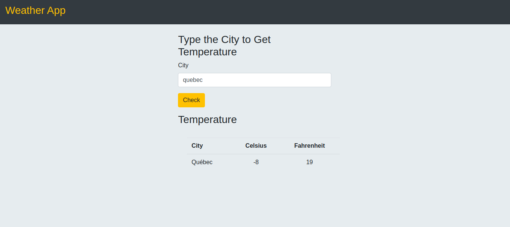

# JavaScript Weather App

> This is a weather forecast site using the weather API Open Weather Map, the idea is to search for a specific location displaying the data in Fahrenheit or Celsius. .

## Built With

- HTML5
- JavaScript
- Bootstrap
- Visual Code

## Live Demo

[Live Demo Link](https://gonjavi.github.io/JavaScriptWeatherApp/)

### Prerequisites
npm 6.13.14

### Setup
 
- Run on the command line: $npm run watch
- Click on: open with live server in Visual code or click on go live
- Once the browser is opened, click on dist folder and it will be ready

### Usage

## Author

👤 **Gonza Javier Mancilla**

- Github: [@github/gonjavi](https://github.com/gonjavi)
- Linkedin: [linkedin](https://www.linkedin.com/in/g-javier-mancilla-a686a9178/)

## 🤝 Contributing

Contributions, issues and feature requests are welcome!

## Show your support

Give a ⭐️ if you like this project!

## 📝 License

This project is [MIT](lic.url) licensed.
